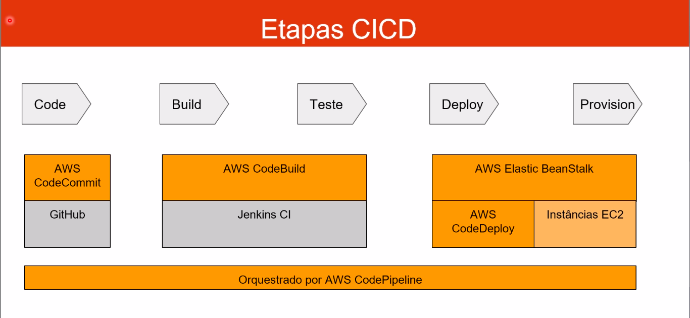

# AWS CICD (Continuous Integration and Continuos Delivery)

**Fluxo de CI/CD na AWS:**

- AWS CodeCommit: Repositório para seu código.
- AWS CodePipeline: Automatiza pipeline do código para o ElasticBeanStalk.
- AWS CodeBuild: Building e testa o código.
- AWS CodeDeploy: Deploy do código para grupo de instâncias EC2.

## Continuous Integration

- Desenvolvedores fazem o push do código para repositórios no Github ou CodeCommit.
- Build Server verifica/testa o código assim que é atualizado usando o CodeBuild ou Jenkins.
- O desenvolver recebe o feedback sobre o teste e verifica se o código passou no teste ou falhou.
- Entre bugs rapidamente.
- Rápido deployment depois do código testado.
- Deployment mais frequente.

## Continuous Delivery

- Garante que o código será distribuído de forma confiável.
- Garante que o deployment pode ser frequente e rápido.
- Muda o conceito de atualizar o código 1 vez por semana para 4 vezes no dia.

## AWS CodeCommit

- Version control é a capacidade de entender e armazenar várias versões do código com a capacidade de rollback.
- Habilitado usando Version Control System tipo git.
- Repositório git pode ser armazenado somente em uma máquina, mas geralmente é armazenado em um repositório online.
- Vantagens do repositório online:
  - Colaborar com outros desenvolvedores.
  - Garante que é feito o backup do código.
  - Garante que está disponível e auditável.
- Repositórios git podem custar caro.
- Github oferece repositórios públicos e privados grátis.
- AWS CodeCommit:
  - Repositório git privado.
  - Sem limite de armazenamento.
  - Gerenciado pela AWS.
  - Alta disponibilidade.
  - Código disponível somente na conta AWS (mais seguro).
  - Segurança com criptografia e controle de acesso.
  - Integrado com Jenkins/CodeBuild e outras ferramentas.

### AWS CodeCommit - Segurança

- Interações são feitas usando git.
- Autenticação em git:
  - SSH: Usuário AWS pode configurar SSH Keys no console IAM.
  - HTTPS: Usando AWS CLI Authentication Helper ou gerando credenciais HTTPS.
  - MFA (Multi Factor Authentication): Pode ser habilitado para segurança extra.
- Autorização git:
  - IAM Policies/Roles com permissão para acessar o repositório.
- Criptografia:
  - Repositório é automaticamente criptografado usando KMS.
  - Criptografia em trânsito deve usar HTTPS ou SSH.
- Cross Account Access:
  - Não compartilhe sua SSH Key.
  - Nao compartilhe sua Credential AWS.
  - Use IAM Role na sua conta AWS e use AWS STS com AssumeRole API.

### AWS CodeCommit VS Github

- Similaridades:
  - Repositório git.
  - Code reviews (pull requests).
  - Pode ser integrado com AWS CodeBuild.
  - Suporta HTTPS e SSH.
- Diferenças:
  - Segurança:
    - Github: Github users.
    - CodeCommit: AWS IAM.
  - Hospedagem:
    - Github: hospedado pelo Github.
    - Github Enterprise: hospedado no seu servidor.
    - CodeCommit: gerenciado e hospedado pela AWS.
  - Interface com o usuário:
    - Github: oferece mais funções.
    - CodeCommit: oferece apenas o básico.

### AWS CodeCommit - Notifications

- Você pode notificar no CodeCommit usando AWS SNS (Simple Notification Service), AWS Lambda ou AWS CloudWatch Event Rules.
- Quando usar notificações SNS/AWS Lambda.
  - Branches deletados.
  - Gatilho para atualizações na branch master.
  - Notificar Build System fora da AWS.
  - Gatilho para AWS Lambda para realizar análise de código.
- Quando usar CloudWatch Event Rules:
  - Gatilho para pull requests updates (created, updated, deleted, commented).
  - CloudWatch Event Rules dispara um tópico SNS.

## AWS CodePipeline

- Utilizado para Continuous Delivery.
- É possível ver o fluxo passo a passo.
- Source (aonde está o código): Github, CodeCommit, Amazon S3.
- Build: CodeBuild, Jenkins.
- Load Test: ferramentas de terceiros.
- Deploy: AWS CodeDeploy, ElasticBeanStalk, CloudFormation, ECS.
- Estágio:
  - Cada estágio pode ter ações executadas de forma serial ou paralela.
  - Exemplos de stages: build, test, deploy, load test...
  - Aprovação manual pode ser habilitada para qualquer estágio.

### AWS CodePipeline - Artifacts

- Cada estágio do pipeline pode criar "artifacts".
- Artifacts são armazenados no S3 e repassados para o proximo estágio.

### AWS CodePipeline - Troubleshooting (solução de problemas)

- Mudanças no CodePipeline Stage acontecem no AWS CloudWatch Event e podem gerar notificações SNS:
  - Possível criar eventos para falhas no pipeline.
  - Possível criar eventos para estágios cancelados.
- Se CodePipeline falhar em um estágio, seu pipeline para e você pode receber informações sobre o erro no console AWS.
- AWS CloudTrail pode ser usado para auditar AWS API Calls.
- Se pipeline não puder executar uma tarefa, confira se IAM Service Role que esta associado tem permissão suficiente (IAM Policy).

## AWS CodeBuild

- Serviço de build gerenciado pela AWS.
- Alternativa para usar como ferramenta de build, similar ao Jenkins.
- Continuous Scaling (Sem servidor para gerenciar ou provisionar).
- Cobrado somente pelo tempo que demora para completar a build.
- Utiliza Docker nos bastidores.
- Possibilidade de estender a capacidade usando nossa própria base do Docker.
- Segurança: Integração com KMS para criptografar os artifacts, IAM para build, VPC para segurança de rede, CloudTrail para API calls logging.
- Source code pode ser do Github, CodeCommit, S3.
- Instruções para oa build podem ser definidas no arquivo `buildspec.yml`.
- Logs podem ser enviados para Amazon S3 e AWS CloudWatch Logs.
- Metrics para monitorar estatísticas do CodeBuild.
- Use CloudWatch Alarm para detectar falhas no build e enviar notificações.
- CloudWatch Events/AWS Lambda como Glue.
- Notificações SNS.
- Possibilidade de reproduzir CodeBuild localmente para troubleshooting em caso de erro.
- Pipeline pode ser definido dentro do CodePipeline ou dentro do próprio CodeBuild.

### AWS CodeBuild - Ambientes suportados

- Java.
- Ruby.
- Python.
- GO.
- NodeJS.
- Android.
- .NET Core.
- PHP.
- Docker - para usar qualquer ambiente desejado.

### AWS CodeBuild - buildspec

- Arquivo `buildspec.yml` deve estar na raiz do projeto.
- Define as Environments Variables:
  - Plaintext variables.
  - Secure secrets: Utiliza SSM Parameter Store.
- Phases (define os comandos a serem executados):
  - Install: Instala as dependências necessárias para a build.
  - Pre Build: Comando final para ser executado antes da build.
  - Build: Comando para construir a build.
  - Post Build: Etapa final, usada por exemplo para criar arquivo zip.
- Artifacts: O que vai ser atualizado no S3 (criptografado pelo KMS).
- Cache: Arquivos para por no cache para acelerar builds futuras.

### AWS CodeBuild - Local build

- O Local Build serve para casos onde é necessário uma investigação mais profunda para identificar problemas onde os logs não são suficientes.
- É possível rodar CodeBuild localmente com Docker.
- Utilizar CodeBuild Agent.

## AWS CodeDeploy

- Faz deploy de aplicação automaticamente para várias instâncias EC2.
- Essas instâncias não são gerenciadas pelo ElasticBeanStalk.
- Existem muitas formas de lidar com deployments usando ferramentas open source como: Ansible, Terraform, Chef, Puppet e etc...
- Podemos utilizar o CodeDeploy que é gerenciado pela AWS.
- Instâncias EC2 são agrupadas pelo Deployment group.
- Várias opções para definir o tipo de deployment.
- CodeDeploy pode ser integrado com CodePipeline e usar Artifacts.
- CodeDeploy pode reusar ferramentas de configuração, funciona com qualquer aplicação, integração com Auto Scaling.
- Blue/Green deployment só funciona com EC2, não funciona com On Premise.
- Suporta AWS Lambda Deployment.
- CodeDeploy não faz provisão de recursos.

### AWS CodeDeploy - Etapas

- Instâncias EC2 ou máquinas On Premise devem ter o CodeDeploy Agent instalado.
- Agent monitora continuamente o AWS CodeDeploy.
- CodeDeploy envia o `appspec.yml`.
- Aplicação é baixada do GitHub ou S3.
- EC2 executará as instruções recebidas.
- CodeDeploy Agent reportará sucesso ou falha no deployment.

### AWS CodeDeploy - Componentes

- Application: Nome único.
- Compute Platform: EC2/On-Premise ou Lambda.
- Deployment Configuration: Regras do Deployment para sucesso ou falha:
  - EC2/On-premise: Pode-se especificar o número mínimo de EC2 saudável para deployment.
  - AWS Lambda: Pode-se especificar como o tráfego será roteado para atualizar o Lambda Function.
- Deployment Group: Grupo de instância com tag.
- Deployment type: In-Place ou Blue/Green.
- Application Revision: Código da aplicação + `appspec.yml`.
- Service Role: Role para CodeDeploy realizar as tarefas necessárias.
- Target Revision: Destino da versão da aplicação.

### AWS CodeDeploy - Appspec

- File Section: Como copiar os arquivos do Github/S3 para o destino.
- Hooks: Conjunto de instruções para deploy da nova versão. Hooks podem ter timeouts.
- Em ordem:
  - ApplicationStop.
  - DownloadBundle.
  - BeforeInstall.
  - Install.
  - AfterInstall.
  - ApplicationStart.
  - ValidateService.

### AWS CodeDeploy - Deployment config

- Configs:
  - One at time: Uma de cada vez. Se uma falhar o deployment para.
  - Half at time: Metade das instâncias por vez.
  - All at once: Todas instâncias são atualizadas de uma vez. Rápido podem possui downtime e é mais utilizada em desenvolvimento.
  - Custom: Deployment personalizado.
- Failures:
  - Instâncias ficam em **_Failed state_**.
  - Novos deployments começam primeiro pelas instâncias em **_Failed state_**.
  - Rollback: Faz deploy do código anterior ou habilita rollback automático quando uma falha acontecer.
- Deployment Targets:
  - Grupo de instâncias EC2 com tags.
  - Direcionado para um ASG.
  - Mistura de ASG e Tags para criar deployment segments.
  - Personalização de scripts com variável de ambiente DEPLOYMENT_GROUP_NAME.
