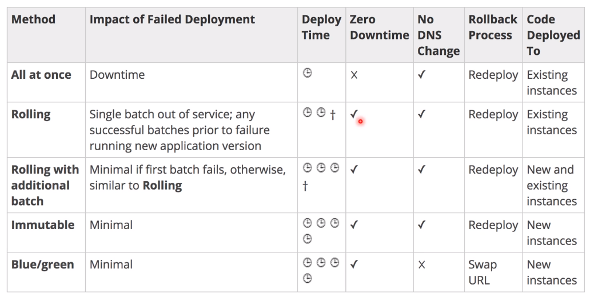

# ElasticBeanStalk

- É voltado para desenvolvedor distribuir sua aplicação na AWS.
- Utiliza componentes já vistos tudo em um só ambiente, tais como:
  - EC2.
  - ASG.
  - ELB.
  - RDS.
  - Outros.
- É possível mudar as configurações.
- O serviço ElasticBeanStalk é grátis, o que é cobrado é os serviços que ele provisiona.
- É gerenciado pela AWS:
  - Configuração da instância/sistema operacional é gerenciado pelo BeanStalk.
  - Deployment é configurável mas é executado pelo BeanStalk.
- Somente o código da aplicação é responsabilidade do desenvolvedor.
- Existem 3 tipos de arquitetura:
  - Single Instance Deployment: Ideal para testes.
  - LB + ASG: Ideal para pré-produção e produção de aplicações web.
  - ASG only: Ideal para serviços.
- Possui três componentes:
  - Application.
  - Application version: Cada deployment recebe uma versão.
  - Environment name: Podem ser customizados mas geralmente são utilizados os nomes prod, dev e test.
- Application version são implantadas para environments.
- Rollback: Restaura a aplicação anterior.
- Controle total do ciclo de vida dos environments.

## ElasticBeanStalk - Plataformas

- Suporta as seguintes plataformas:
  - GO.
  - Java.
  - Tomcat.
  - .NET (Windows Server com IIS).
  - .NET (Linux server).
  - NodeJS.
  - PHP.
  - Python.
  - Ruby.
  - Docker.
- Funciona com:
  - Single container Docker.
  - Multi container Docker.
  - Pre configured Docker.
  - Se a plataforma não for suportada é possível criar uma personalizada.

## ElasticBeanStalk - Deployment Modes

- **All at once:** Atualiza tudo de uma vez só, tornando a aplicação indisponível durante a atualização.
  - Publicação rápida.
  - Aplicação para de funcionar durante a publicação.
  - Ideal para desenvolvimento.
  - Não tem custo adicional.
- **Rolling:** Atualiza o grupo de instancias (bucket), quando finalizar o primeiro bucket e a instância for considerada saudável o BeanStalk seguirá para o proximo bucket.
  - Aplicação roda com capacidade menor.
  - Tamanho do bucket é ajustável.
  - Aplicação roda duas versões ao mesmo tempo.
  - Não tem custo adicional e demora mais que a **All at once**.
- **Rolling with additional batches:** Similar ao **Rolling** porém inicia novas instâncias para instalar a nova versão, deixando as antigas instâncias disponíveis.
  - Aplicação roda com capacidade total.
  - Tamanho do bucket é ajustável.
  - Aplicação roda duas versões ao mesmo tempo.
  - Instâncias adicionais são terminadas ao final.
  - Demora mais.
  - Ideal para produção.
- **Immutable:** Inicia novas instâncias em um novo ASG, publica a aplicação para as novas instâncias e então alterna o trafego para elas assim que forem consideradas saudáveis.
  - Zero Down Time.
  - Novo código é publicado para um novo ASG.
  - Rápido rollback em caso de falhas.
  - Custo maior.
  - Ideal para produção.

## ElasticBeanStalk - Blue/Green Deployment

- Não é uma função do ElasticBeanStalk.
- Cria um novo Environment e publica a nova versão nele.
- Novo environment (Green) pode ser validado e, se necessário, pode ser feito o rollback.
- Route 53 pode ser configurado com **Weighted Policy** para redirecionar parte do tráfego.
- Use BeanStalk para fazer o **Swap URL** quando o teste do novo environment finalizar.

## ElasticBeanStalk - Comparação entre os deployments mode

